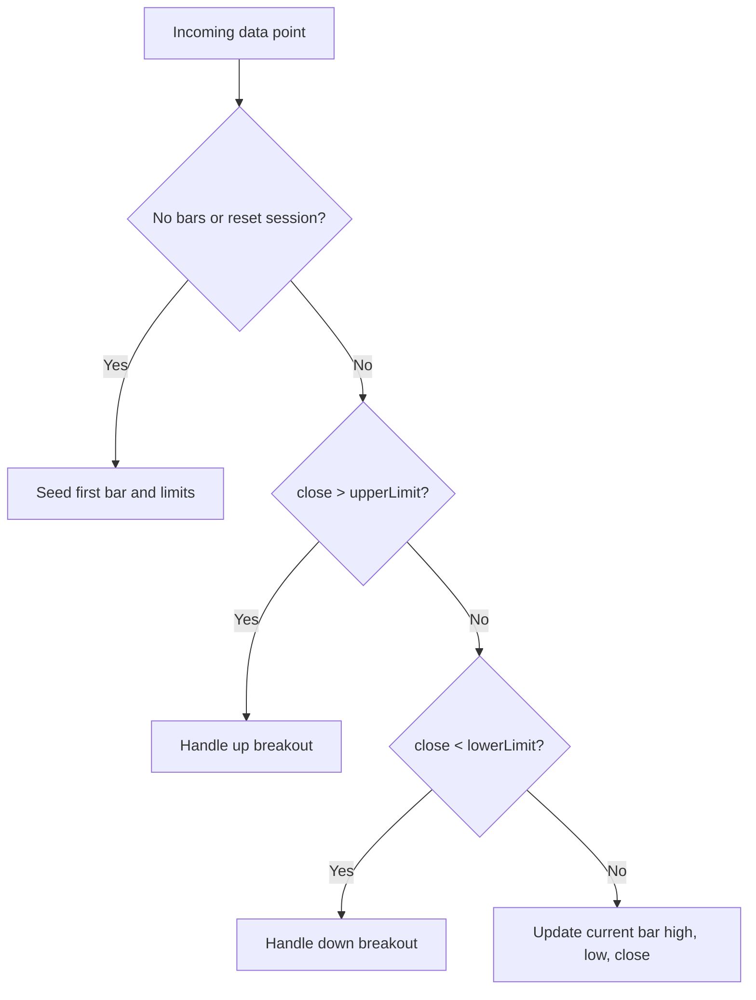

# ninZaRenko Bar Type Engineering Summary

Source reviewed: `ninZaRenko.cs`

## Purpose

`ninZaRenko` is a custom NinjaTrader 8 `BarsType` that builds intraday, tick-fed Renko-style bars. It uses two user-facing parameters:

| NinjaTrader Property | UI Label | Meaning | Default |
| --- | --- | --- | --- |
| `BarsPeriod.Value` | `Brick Size` | Nominal full brick size, in ticks | `8` |
| `BarsPeriod.Value2` | `Trend Threshold` | Price movement threshold needed to advance the bar stream, in ticks | `4` |

The bar type is registered with custom `BarsPeriodType` value `12345`, is built from ticks, is not time-based, and defaults to five days of historical data.

## Core Concepts

On the first data point, the bar type converts user tick values into instrument prices:

```csharp
tickSize       = bars.Instrument.MasterInstrument.TickSize;
brickSize      = BarsPeriod.Value  * tickSize;
trendThreshold = BarsPeriod.Value2 * tickSize;
openOffset     = brickSize - trendThreshold;
```

The important relationship is:

```text
openOffset = Brick Size - Trend Threshold
```

For the default `8/4` setting:

```text
brickSize      = 8 ticks
trendThreshold = 4 ticks
openOffset     = 4 ticks
```

The algorithm maintains two moving breakout levels:

| Field | Role |
| --- | --- |
| `upperLimit` | Price above which an up move creates/advances bars |
| `lowerLimit` | Price below which a down move creates/advances bars |

Breakouts are strict comparisons:

```csharp
breakUp   = close > upperLimit;
breakDown = close < lowerLimit;
```

A close exactly equal to `upperLimit` or `lowerLimit` does not trigger a new bar.

## Session And Initialization Behavior

The first bar is seeded from the first incoming close:

```text
upperLimit = close + trendThreshold
lowerLimit = close - trendThreshold
AddBar(open=close, high=close, low=close, close=close)
```

The same reset path is used when `bars.IsResetOnNewTradingDay` is true and the `SessionIterator` reports a new session.

The computed values `tickSize`, `brickSize`, `trendThreshold`, and `openOffset` are initialized once per `BarsType` instance. Session resets reset the active limits and seed bar, but do not recompute those constants.

## Data Point Flow

Every incoming tick/data point follows this decision tree:



At the end of every data point, `bars.LastPrice` is set to the incoming `close`.

## Normal In-Bar Update

When price has not crossed either limit, the current bar is updated:

```csharp
high  = Math.Max(close, currentHigh)
low   = Math.Min(close, currentLow)
close = incoming close
```

The source volume is passed through on these non-breakout updates.

## Up Breakout Behavior

An up breakout occurs when:

```text
close > upperLimit
```

The algorithm then:

1. Closes the current bar at the current `upperLimit`.
2. Advances `upperLimit` by one `trendThreshold`.
3. If price has moved beyond the next `upperLimit`, emits zero-volume synthetic intermediate up bars.
4. Opens a new live/developing up bar using the incoming close and source volume.
5. Repositions `lowerLimit` from the new open.

The prior bar is first updated like this:

```text
high  = upperLimit
low   = previous low
close = upperLimit
volume = 0
```

For each synthetic intermediate up bar:

```text
open  = previous close - openOffset
high  = upperLimit
low   = open
close = upperLimit
volume = 0
```

Then the final developing up bar is added:

```text
openPrice  = previous close - openOffset
lowerLimit = openPrice - brickSize

open  = openPrice
high  = incoming close
low   = openPrice
close = incoming close
volume = incoming volume
```

## Down Breakout Behavior

A down breakout occurs when:

```text
close < lowerLimit
```

The algorithm mirrors the up breakout:

1. Closes the current bar at the current `lowerLimit`.
2. Advances `lowerLimit` downward by one `trendThreshold`.
3. If price has moved beyond the next `lowerLimit`, emits zero-volume synthetic intermediate down bars.
4. Opens a new live/developing down bar using the incoming close and source volume.
5. Repositions `upperLimit` from the new open.

The prior bar is first updated like this:

```text
high  = previous high
low   = lowerLimit
close = lowerLimit
volume = 0
```

For each synthetic intermediate down bar:

```text
open  = previous close + openOffset
high  = open
low   = lowerLimit
close = lowerLimit
volume = 0
```

Then the final developing down bar is added:

```text
openPrice  = previous close + openOffset
upperLimit = openPrice + brickSize

open  = openPrice
high  = openPrice
low   = incoming close
close = incoming close
volume = incoming volume
```

## Gap And Fast-Move Handling

If an incoming close crosses more than one threshold, the code emits additional completed bars before adding the final developing bar.

Up move calculation:

```csharp
extraTicks = Abs((close - upperLimit) / tickSize)
extraBars  = 1 + extraTicks / BarsPeriod.Value2
```

Down move calculation:

```csharp
extraTicks = Abs((lowerLimit - close) / tickSize)
extraBars  = 1 + extraTicks / BarsPeriod.Value2
```

The divisor is `Trend Threshold` ticks, not `Brick Size` ticks. This means fast moves are expanded in threshold-sized steps.

Synthetic intermediate bars use zero volume. The final bar created from the incoming data point receives the incoming volume.

## Important Behavioral Notes For Agents

- This is not a plain fixed-size Renko implementation. It is controlled by both `Brick Size` and `Trend Threshold`.
- `Trend Threshold` controls how far price must move to advance the bar stream.
- `Brick Size` controls the distance used to place the reversal boundary after a new bar opens.
- `openOffset` controls the visual overlap/open placement of newly created bars.
- A smaller `Trend Threshold` relative to `Brick Size` creates more frequent threshold advances and larger open offsets.
- If `Brick Size == Trend Threshold`, `openOffset` becomes zero and new bars open at the previous close.
- If `Trend Threshold > Brick Size`, `openOffset` becomes negative, which would invert the intended open placement. Agents modifying or validating this bar type should consider guarding against that configuration.
- Breakouts require price to exceed the limit. Touching the limit updates the current bar but does not create a new bar.
- Intermediate bars created during fast moves are synthetic and zero-volume.
- The code uses `ApproxCompare`, which is appropriate for floating-point price comparisons in NinjaTrader.
- `GetPercentComplete` always returns `0.0`, which is expected for non-time-based bars.

## Strategy And Indicator Implications

Agents building strategies against this bar type should account for the following:

- Multiple bars can be created from a single incoming tick during a fast move.
- Several bars may share the same timestamp when generated from one data point.
- Historical/replay behavior can differ from time-based bars because bar creation depends on incoming close values crossing strict dynamic thresholds.
- Volume on completed synthetic bars may be zero, so volume-based signals should be tested carefully.
- Reversal boundaries are reset from the newly opened bar, not simply from the previous limit.
- Signal code should avoid assuming every bar represents exactly `Brick Size` ticks of movement.

## Minimal Pseudocode

```text
on data point:
    if first data point:
        compute tick-based constants

    update session iterator

    if no bars exist or reset-on-new-session:
        upperLimit = close + trendThreshold
        lowerLimit = close - trendThreshold
        add seed bar at close
        return

    if close > upperLimit:
        close current bar at upperLimit
        upperLimit += trendThreshold

        while close > upperLimit:
            add synthetic up bar from previous close - openOffset to upperLimit
            upperLimit += trendThreshold

        openPrice = previous close - openOffset
        lowerLimit = openPrice - brickSize
        add developing up bar from openPrice to close

    else if close < lowerLimit:
        close current bar at lowerLimit
        lowerLimit -= trendThreshold

        while close < lowerLimit:
            add synthetic down bar from previous close + openOffset to lowerLimit
            lowerLimit -= trendThreshold

        openPrice = previous close + openOffset
        upperLimit = openPrice + brickSize
        add developing down bar from openPrice to close

    else:
        update current bar high, low, and close

    bars.LastPrice = close
```

Note: the real code computes the number of intermediate bars up front rather than using a literal `while` loop. The pseudocode expresses the same intent more clearly for agents.

## Review Notes

Potential guardrails worth considering if this bar type is modified:

- Validate that both `Brick Size` and `Trend Threshold` are positive.
- Validate that `Trend Threshold <= Brick Size` unless negative `openOffset` behavior is intentionally supported.
- Consider documenting that strict threshold crossing is intentional.
- Consider comments around the zero-volume synthetic bars so future maintainers do not treat them as a missing-volume bug.
- Confirm the custom `BarsPeriodType` ID `12345` does not collide with any other local custom bar types.
